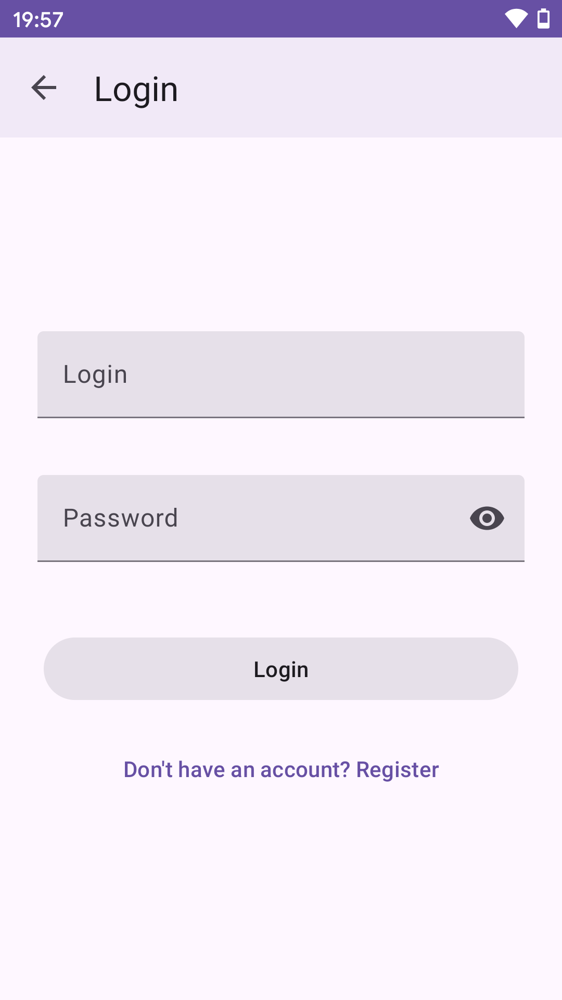
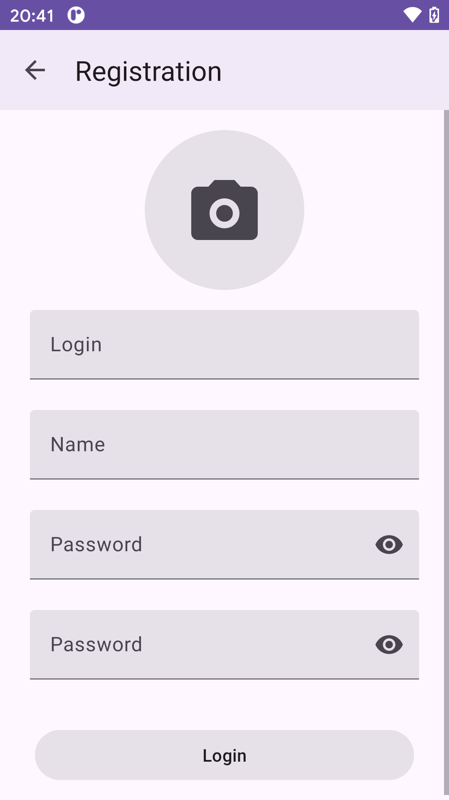
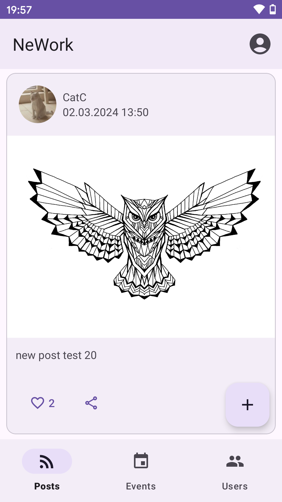
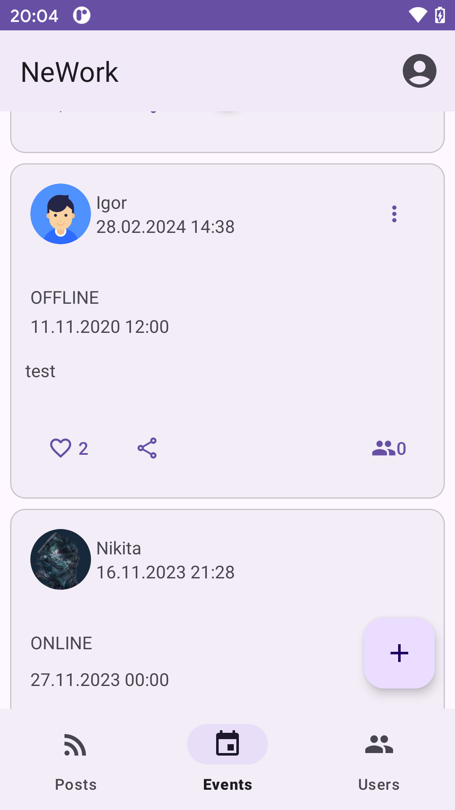
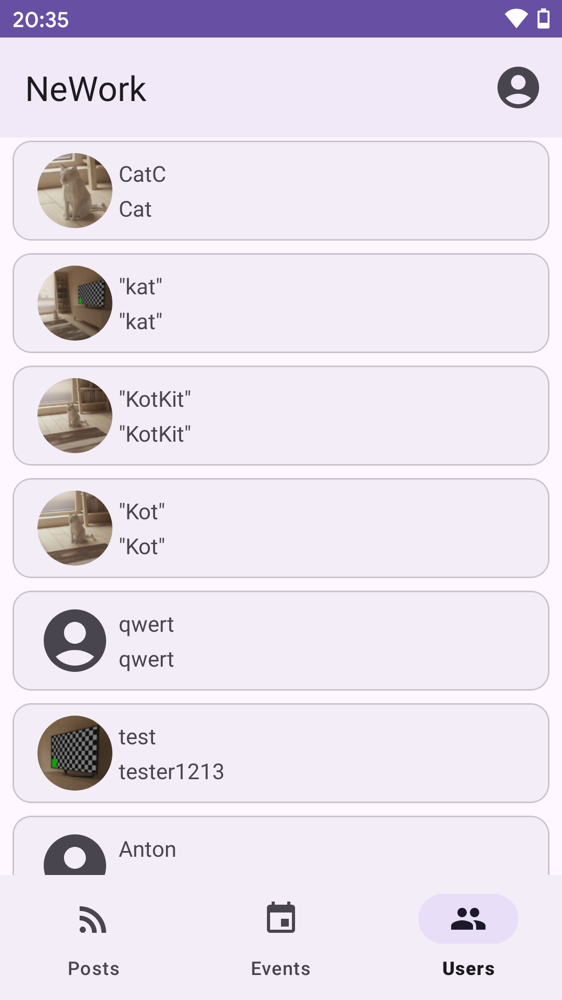
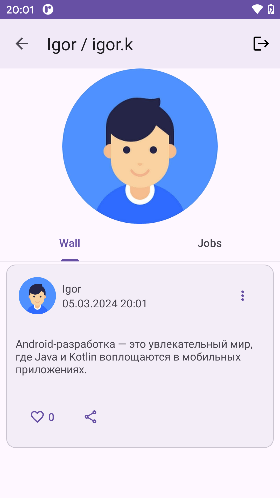
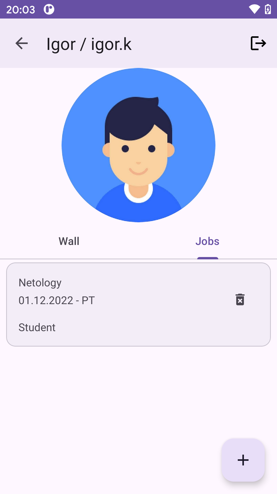

# Мобильное приложение NeWork

Приложение представляет из себя социальную сеть, которая позволит пользователям создавать посты и события, указывать свои места работы.

#### Инструменты

+ Android Studio.
+ Kotlin.
+ Navigation component.
+ Retrofit.
+ Dagger Hilt.
+ Swagger.
+ Figma.
+ Git + GitHub.

## Скриншоты

#### Экраны входа/регистрации.
 

#### Основные экраны.
  

#### Экран информации о пользователе.
 